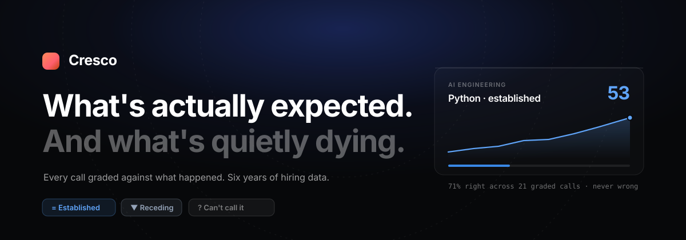
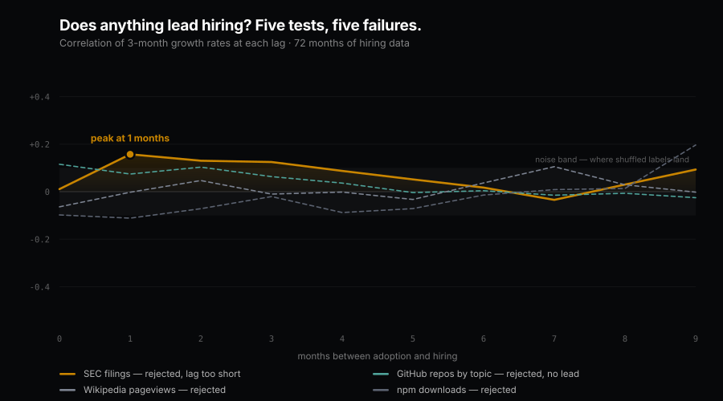

<div align="center">



<br>

**A skill-demand radar that grades its own predictions — and publishes the score,
including the calls it cannot make.**

<br>


</div>

<br>

Every *"skills to learn in 2026"* list is written by someone with an incentive, from
sources that all cite each other. None of them ever tell you whether last year's list
was right.

Cresco watches hiring demand across six sources, weights them so noise cannot
masquerade as demand, writes every verdict down as a **dated, falsifiable claim**, and
then **grades itself** against what actually happened. Its hit rate is on the
dashboard. So is every call it got wrong.

```bash
npm install && npm run backfill && npm run dev
```

<br>

---

## The receipts

<div align="center">

</div>

Job postings are where demand *arrives*, not where it starts — so predicting hiring from
hiring means fighting sampling noise for something that already happened. We spent real
effort testing whether anything upstream **leads** it.

**It doesn't. Or at least, nothing we tested does.**

### A finding that died as the data grew

Wikipedia pageviews looked like a six-month leading indicator. On 16 months of hiring
history the hold-out correlation was **+0.440**, with only 2.3% of shuffled nulls beating
it — a publishable-looking number that went into this README.

Then we fixed a bug that had been silently truncating the hiring archive, and kept
extending it:

| Hiring history | Hold-out r | Nulls beating it | Reading |
|---|---|---|---|
| 16 months | +0.440 | 2.3% | survives |
| 19 months | +0.394 | 1.0% | survives |
| 22 months | +0.210 | 7.5% | weak |
| **72 months** | **+0.043** | **18.3%** | **dead** |

A clean monotonic decay as the sample grew. That is the signature of a finding that was
never real — an artefact of one small, recent window. The six-month lag stayed put the
whole way, which is what made it convincing; the correlation underneath it evaporated.

### Everything else we tested

| Candidate | Hold-out r | Nulls beating it | Verdict |
|---|---|---|---|
| **SEC EDGAR** filings naming a technology | +0.117 | 19.0% | weak, and the lag is 1–2 months |
| **Wikipedia** pageviews | +0.043 | 18.3% | rejected |
| **npm** downloads | +0.012 | 28.0% | rejected |
| **Market adjustment** (Indeed index) | — | — | rejected: −17pp on the backtest |

SEC EDGAR was the most promising on mechanism — companies describe commitments to
investors before they staff them — and it is the best of the three, with 91% of hold-out
splits positive against Wikipedia's 69%. It still does not clear the bar, and its peak
lag comes out at **1–2 months**. Even if the correlation were solid, a two-month warning
is useless for a tool whose entire purpose is telling you what to start learning.

One pre-specified follow-up was attempted — a minimum-volume floor, on the same logic as
the evidence floor already used for verdicts, since several EDGAR series run at 0–2
filings a month. Only one skill cleared it, so there was no split left to test. We
stopped there rather than hunting for a threshold that happened to work.

**Four hypotheses tested, four refuted.** That table is the project working as intended.

## How it grades itself

| Step | Status |
|---|---|
| 1. Collect, unattended — six sources on a schedule | **built** |
| 2. Commit to a call — dated, falsifiable, with a check-back date | **built** |
| 3. Score itself by replaying history with no lookahead | **built** |
| 4. Reweight sources by which ones survived scoring | next |

`npm run backtest` replays the ledger month by month: grade whatever has come due, then
mint new calls from **only** the data that existed at that point. Signals at step *m*
are computed from `snapshots.slice(0, m+1)`, so the reference scale, the momentum
window and source eligibility all see exactly what they would have seen at the time.

**Current score — 85 graded calls over 72 months:**

| Call type | Hit rate | Right / wrong / partial |
|---|---|---|
| **Table stakes** | **71%** | 15 / **0** / 6 |
| **Cooling** | **64%** | 7 / **0** / 4 |
| **Rising** | 29% | 14 / 23 / 11 |
| **Hype** | 20% | 1 / 4 / 0 |
| **Overall** | **44%** | 37 / 27 / 21 |

### What this product can and cannot do

Read that table honestly and it splits cleanly in two.

**It works for what is established and what is losing ground.** Across 32 graded `table-stakes`
and `cooling` calls it was **wrong zero times** — the misses are all "partial", meaning
the skill went flatter than called rather than moving the other way. Those are the calls
worth acting on: *this is assumed knowledge now*, and *this is losing ground*.

**It does not work for what is about to rise.** `rising` is 29% and `hype` is 20% —
worse than useless, since a wrong call sends you off to learn the wrong thing. Every
"skills to learn next year" list is making exactly this call, and we can now show, on
six years of real data, that we cannot make it reliably. Neither, presumably, can they.

The dashboard is built around that split. `Established` and `Receding` lead the page;
`Rising` and `Hype` are kept visible but visually subordinate, under a heading that says
**"Where we can't call it"**, with their real hit rates printed on every badge.

**A note on how sparse the board looks.** Only about five of twenty-five skills get a
confident call; the rest read "no call". That is deliberate, and it was tested — lowering
the `table-stakes` threshold to widen coverage degrades accuracy monotonically:

| Threshold | Hit rate | Graded | Wrong | Skills with a call |
|---|---|---|---|---|
| **45** | **71%** | 21 | **0** | 5 |
| 35 | 66% | 29 | 2 | 6 |
| 25 | 55% | 40 | 7 | 6 |
| 18 | 52% | 54 | 8 | 8 |

The rule was "take the widest coverage whose accuracy does not degrade", and the answer
came back: keep 45. Confident calls are genuinely rare, and a fuller-looking dashboard
would be a less truthful one.

<details>
<summary><b>Why <code>rising</code> fails, and what we tried</b></summary>

<br>

The median month-to-month swing in a skill's index is **19%** — sampling jitter from
which companies happened to post that month. The original threshold was **12%**, i.e.
*below* the noise floor, so it was classifying noise as trend.

Worse, momentum on this source is mildly **anti**-predictive: correlation −0.15 with
what happens next, with rising calls followed by an average 5% fall and cooling calls
by a 16% rise. Textbook mean reversion.

Smoothing over three months and raising thresholds to twice the smoothed noise floor
lifted the overall rate from 32% to 45% on the smaller ledger. On the full 22 months it
sits at 39% with `rising` at 32%. Tuning stopped there rather than continuing until the
numbers flattered the project.

</details>

<br>

## The one idea underneath it

> A skill named in a paid job advert is someone committing **money**.
> A skill trending on social is someone committing **a sentence**.

The **signal-to-noise** figure on every card is the share of a skill's score carried by
people actually paying for it. Sort by it and hype separates from demand.

<br>

## Quickstart

```bash
npm install
npm run backfill      # 22 months of REAL history, mined from Hacker News. No key needed.
npm run dev           # → http://localhost:3000
```

`backfill` is the one that matters. Most sources only answer *"what is true now"* — you
cannot ask a job board what it said in March. Hacker News is the exception: the monthly
**"Ask HN: Who is hiring?"** threads are a genuine, dated, public hiring archive, so
Cresco reconstructs two years of real signal on first run instead of making you wait.

```bash
npm run backtest      # replay history and grade the calls it would have made
npm run leading       # fetch leading indicators (npm + Wikipedia, 36 months, no key)
npm run leadlag       # measure whether adoption leads hiring, and by how long
npm run holdout       # validate that lead out-of-sample against a shuffled null
npm run chart         # regenerate docs/leadlag.svg from current data
npm run paths         # free YouTube learning paths (needs a YouTube key)
npm run collect       # add today's snapshot from all six sources
npm run seed          # offline fallback: synthetic history, clearly labelled
```

<details>
<summary><b>Running it while you're away</b></summary>

<br>

```bash
0 7 * * 1  cd /path/to/cresco && npm run collect -- --paths
```

A run that finds nothing materially new reports **no material change** and stops. That
is a deliberate rule: an unattended agent that has to justify its weekly slot will
manufacture novelty, and you will come home to forty pages of slop.

</details>

<details>
<summary><b>Adding API keys (all free, all optional)</b></summary>

<br>

| Key | Where | Time |
|---|---|---|
| `YOUTUBE_API_KEY` | Google Cloud console → enable *YouTube Data API v3* → API key | ~5 min, no billing card |
| `ADZUNA_APP_ID` / `ADZUNA_APP_KEY` | developer.adzuna.com → register | ~5 min |

</details>

<br>

## Sources

| Source | Class | Key | Notes |
|---|:---:|:---:|---|
| **HN "Who is Hiring?"** | `hiring` | — | The sharpest free hiring signal on the open web. Every comment is one company describing one real role, dated, no recruiter SEO. |
| **Adzuna** | `hiring` | free | Live job-advert counts by keyword. |
| **Hacker News** | `practitioner` | — | Early indicator, and a reliable source of noise — weighted accordingly. |
| **Reddit** | `community` | — | Best-effort via public JSON; rate-limited. |
| **Bluesky** | `community` | — | Public AT Protocol. The social signal that is actually open. |
| **YouTube** | `content` | free | Weak as demand — content follows hype. Essential as supply. |
| **Wikipedia** | *leading* | — | 36 months of pageviews. Measured, not yet trusted. |
| **npm** | *leading* | — | Collected and **rejected** — see the receipts above. |

**Deliberately absent:** X/Twitter is a paid API tier, and LinkedIn has no public API
for this. Shipping a collector that breaks or invites a cease-and-desist would be worse
than not having one.

<br>

## How the index works

**1 · Count share, never volume.** The monthly hiring threads swing between 240 and 413
posts, so raw mention counts largely measure how busy the thread was — which made 22 of
25 skills read as "cooling" in a quiet month. Everything is stored per 1,000 job posts.

**2 · Normalise** each source against a **ledger-wide** reference scale, never the
current snapshot. Scale per-snapshot and a board where everything rises reads as flat.

**3 · Weight** by source class:

```
hiring 1.0   practitioner 0.7   community 0.45   content 0.35   vendor 0.2
```

**4 · Momentum** compares the last two snapshots, smoothed over three months, against
the preceding baseline window.

**5 · Signal-to-noise** is the share of weight carried by hiring evidence *alone*.
Practitioner chatter is weighted above social chatter but is still talk — counting it
as substance let a skill with 95 job adverts and a wall of blog posts read as real
demand.

Three rules keep the score honest, and each exists because it caught a real bug:

- **A new source gets no vote until it has three snapshots of its own.** Otherwise
  adding a collector rewrites the present without touching the past, and the jump shows
  up as momentum nothing in the world caused.
- **Fixture data never scores** in a real ledger. A collector falling back to sample
  data for want of a key must not quietly contribute invented numbers.
- **No call below an evidence floor.** One job advert becoming two is a 100% rise and
  means nothing.

| Verdict | Means | Measured hit rate |
|---|---|---|
| 🔵 **Table stakes** | Assumed rather than advertised — gaps here cost you quietly. | **71%**, never wrong |
| ⚪ **Cooling** | Demand receding. | **64%**, never wrong |
| 🟢 **Rising** | Climbing, and hiring is carrying the rise. | 29% — do not act on this |
| 🟡 **Hype** | Loud, but nobody is paying for it yet. | 20% — do not act on this |
| ⚫ **No call** | Not enough history to say anything honest. | — |

<br>

## Honest status

- **72 real months** (Sep 2020 → Aug 2026) mined from the Hacker News hiring archive.
  `npm run seed` generates a synthetic ledger for offline demos and flags itself as
  seeded in the UI *and* the data.
- **Only two sources currently score:** `whoshiring` and `hackernews`. Adzuna, YouTube,
  Bluesky and Reddit contribute evidence and learning paths now, and join the index once
  they have three snapshots of their own.
- **No leading indicator survived testing.** Wikipedia and npm were both measured and
  both rejected on the full history. Nothing in the product depends on either, and the
  collectors remain only so the tests can be re-run against new data.
- **Market adjustment was tested and rejected** — it costs 17 percentage points of
  accuracy. `data/market.json` is kept as context, not as an input.
- **Sample sizes are moderate** — 5 to 48 graded calls per verdict type across 85 total.
  `table-stakes` (n=21) and `cooling` (n=11) are the load-bearing ones.
- **The hiring signal is Hacker News**, so it reads startup and tech-forward hiring, not
  the whole labour market.
- **Source reweighting (step 4) is not built.**
- **Proxy coverage is partial and honest.** 23 of 25 skills have an npm or Wikipedia
  proxy; the rest keep their lagging signal only. No proxy was invented to fill a blank.

<br>

## Two bugs worth knowing about

Both were the same failure wearing different clothes, and both nearly became findings:

**Throttling disguised as absence.** Wikimedia rate-limits, and the HTTP helper turned a
429 into `null` — which reads exactly like *"no such article"*. Ten valid titles were
briefly recorded as missing proxies. The Hacker News backfill did the same to itself at
scale: ~1,500 queries into a run it would start getting throttled, and because it
processed oldest-first, the months it silently lost were always the **most recent** ones.
That is what produced the 16-month ledger and the +0.440 that did not hold.

Both now serialise their requests, retry before believing a null, and the backfill
processes newest-first so throttling costs old history rather than the months the
dashboard reports on.

<br>

## What's being researched next

Job postings lag. [`docs/RESEARCH.md`](docs/RESEARCH.md) holds verified notes on
candidate **leading** indicators — every endpoint called live, with the traps that would
have manufactured fake signals written down next to them.

Wikipedia and npm were tested against 72 months of hiring data and both failed. Three
candidates remain untested, and each has a mechanism behind it rather than just a
correlation: **SEC EDGAR full-text search** (companies naming a technology to investors
quarters before they staff it — Model Context Protocol went 0 → 1 → 26 → 40 across
recent quarters), **GitHub repos by topic and creation month** (the `topic:mcp` curve
inflects in exactly the month MCP launched), and **conference programmes** via public
`.ics` feeds, where FOSDEM alone offers 13 years.

The hiring history that used to be the constraint is now 72 months, so these are
properly testable. Given three refutations so far, the prior should be that they fail
too — and the test is cheap enough that finding out is still worth it.

<br>

## Stack

TypeScript · React 19 · Vite 6 · Express · Tailwind 4.
Storage is a JSON ledger on disk — no database, deliberately.

<br>

---

<div align="center">
<sub><a href="LICENSE">MIT Licence</a></sub>
</div>
